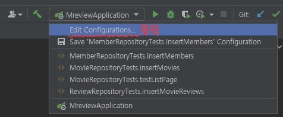
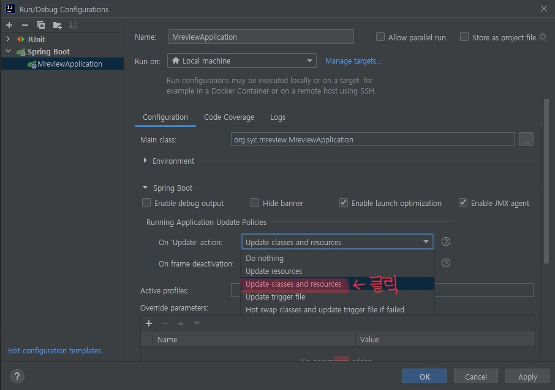
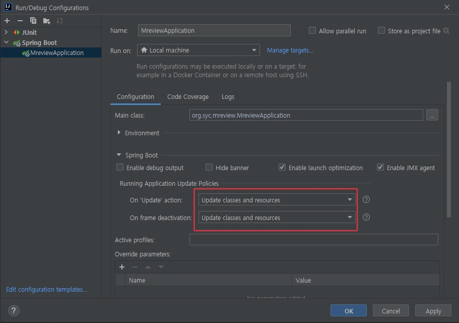

# 코드로 배우는 스프링부트 웹 프로젝트 Part4 Chapter7
## 프로젝트 명 : mreview  

***
> ### Part 4 N:N(다대다) 관계와 파일 업로드 처리  
> >  #### 7. M:n(다대다) 관계의 설계와 구현 
> > > 7.1 M:N(다대다) 관계의 특징(345p)  
> > > 7.2 예제 프로젝트 생성(349p)  
> > > 7.3 M:N(다대다) Repository와 테스트(359p)   

* ### 설정 
1. #### Gradle projects 에서 'Build and run using', 'Run tests using' 변경하기  
   * Ctrl + Alt + S 눌러서 setting 들어가기  
   *   

2. #### Annotation Processors 체크  
   *   

3. ### Thymeleaf수정시 자동재가동 설정  
   * 클릭하기    
   * Do nothing -> Update classes and resources    
   * 둘다 변경 후 Apply 및 OK    
***  
### 변경이력  
|index|branch|commit|날짜|비고|
|:---:|:----:|:-----|:---:|:---|
|1|main|프로젝트 생성 @main|2021-09-10|프로젝트 첫 생성후 'build.gradle'에 타임리프 날짜 라이브러리 주입 application.properties의 파일형식 yml로 변경 및 마리아디비의 bootex디비 서버에 연결 백업을 제대로 해두자... 프로젝트 다시 생성하고 원격저장소도 2번이나 갈아 엎었음 |
|2|main|프로젝트 생성_업데이트 @main|2021-09-10|놓친 파일들 에드하고 커밋후 푸쉬|
|3|main|README.md 수정 @syc|2021-09-10|변경이력 테이블 수정|
|4|syc|README.md 수정 @syc|2021-09-10|브랜치 생성 안해줘서 생성하고 수정후 커밋 및 푸쉬|
|5|syc|BaseEntity 클래스 생성 @syc|2021-09-10|commit 참조|
|6|syc|Member Entity 클래스 생성 @syc|2021-09-10|commit 참조|
|7|syc|Movie Entity 클래스 생성 @syc|2021-09-10|commit 참조|
|8|syc|MovieImage Entity 클래스 생성 @syc|2021-09-10|commit 참조|
|9|syc|Review Entity 클래스 생성 @syc|2021-09-10|commit 참조|
|10|syc|'MreviewApplication'에 '@EnableJpaAuditing' 주입 @syc|2021-09-10|commit 참조|
|11|syc|MemberRepository 인터페이스 생성 @syc|2021-09-10|commit 참조|
|12|syc|MovieImageRepository 인터페이스 생성 @syc|2021-09-10|commit 참조|
|13|syc|MovieRepository 인터페이스 생성 @syc|2021-09-10|commit 참조|
|14|syc|ReviewRepository 인터페이스 생성 @syc|2021-09-10|commit 참조|
|15|syc|MemberRepositoryTests 클래스 생성 @syc|2021-09-10|commit 참조|
|16|syc|MovieRepositoryTests 클래스 생성 @syc|2021-09-10|commit 참조|
|17|syc|ReviewRepositoryTests 클래스 생성 @syc|2021-09-10|commit 참조|
|18|syc|업데이트 @syc|2021-09-10|commit 참조|
|19|syc|업데이트 @syc|2021-09-10|commit 참조|
|20|syc|MoviewRepository 인터페이스에 JPQL 추가 @syc|2021-09-10|commit 참조|
|21|syc|MoviewRepository 인터페이스에 JPQL 수정 @syc|2021-09-10|commit 참조|
|22|syc|MoviewRepositoryTests testListPage() 추가 @syc|2021-09-10|commit 참조|
|23|syc|업데이트 @syc|2021-09-10|commit 참조|
|24|syc|MoviewRepository 인터페이스, 영화마다 이미지를 찾는 비효율적인 쿼리 추가 @syc|2021-09-10|commit 참조|
|25|syc|업데이트 @syc|2021-09-10|commit 참조|
|26|syc|MoviewRepository 인터페이스, 페이징 처리 JPQL 수정, max()처리 제거 @syc|2021-09-10|commit 참조|
|27|syc|업데이트 @syc|2021-09-10|commit 참조|
|28|syc|업데이트 @syc|2021-09-10|commit 참조|
|29|syc|README.md 수정 @syc|2021-09-10|commit 참조|
|30|syc|MovieRepository 인터페이스, 툭정 영화 조회 처리 추가 @syc|2021-09-10|commit 참조|
|31|syc|MovieRepositoryTests 클래스에 testGetMovieWithAll() 테스트용 기능 추가 @syc|2021-09-10|commit 참조|
|32|syc|MovieRepository 인터페이스에 getMovieWithAll() 수정 @syc|2021-09-10|commit 참조|
|33|syc|업데이트 @syc|2021-09-10|commit 참조|
|34|syc|MovieRepository 인터페이스에 getMovieWithAll()의 JPQL 쿼리문 추가 수정 @syc|2021-09-10|commit 참조|
|35|syc|MovieRepository 인터페이스에 getMovieWithAll()의 JPQL 쿼리문 추가 수정 @syc|2021-09-10|commit 참조|
|36|syc|ReviewRepository 인터페이스에서 특정 영화 번호를 이용한 해당 영화를 리뷰한 정보 조회를 위한 메서드 추가 @syc|2021-09-10|commit 참조|
|37|syc|ReviewRepositoryTests 클래스에서 Review에서 필요한 데이터를 추출하기 위한 testGetMovieReviews() 추가 @syc|2021-09-10|commit 참조|
|38|syc|ReviewRepository 인터페이스에 '@EntityGraph' 추가 @syc|2021-09-10|commit 참조|
|39|syc|ReviewRepositoryTests '@Test'추가 및 간단한 수정 @syc|2021-09-10|commit 참조|
|40|syc|ReviewRepository 인터페이스에 deleteByMember() 메서드 추가 @syc|2021-09-10|commit 참조|
|41|syc|ReviewRepository 인터페이스에 deleteByMember() 메서드, 주석 오타 수정 @syc|2021-09-10|commit 참조|
|42|syc|업데이트 @syc|2021-09-10|commit 참조|
|43|syc|MemberRepositoryTests 클래스, 회원 삭제를 위해서 ReviewRepository 연결 후 testDeleteMember() 메서드 정의, 1번 회원 제거 @syc|2021-09-10|commit 참조|
|44|syc|MemberRepositoryTests 클래스, testDeleteMember()메서드의 수정, '@Transactional', '@Commit'추가 및 순서 변경 @syc|2021-09-10|commit 참조|
|45|syc|ReviewRepository 인  페이스에서 findByMovie() 메서드에 @Modifying, @Query 추가 @syc|2021-09-10|commit 참조|
|46|syc|업데이트 @syc|2021-09-10|commit 참조|
|47|syc|README.md 수정 @syc|2021-09-10|commit 참조|
|48|syc|업데이트 @syc|2021-09-10|commit 참조|
|49|syc|README.md 수정 @syc|2021-09-10|제발 한번에!!!!|
