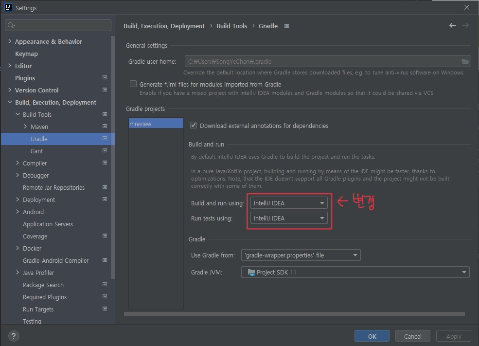
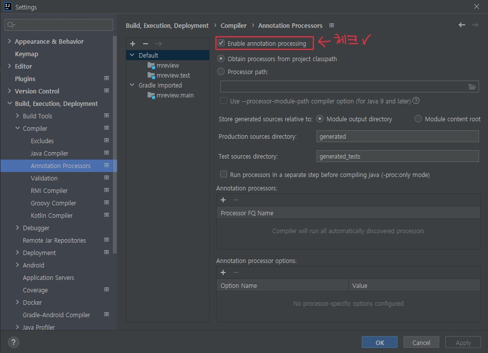

# 코드로 배우는 스프링부트 웹 프로젝트 Part4 Chapter7
## 프로젝트 명 : mreview  

***
> ### Part 4 N:N(다대다) 관계와 파일 업로드 처리  
> >  #### 7. M:n(다대다) 관계의 설계와 구현 
> > > 7.1 M:N(다대다) 관계의 특징(345p)  
> > > 7.2 예제 프로젝트 생성(349p)  
> > > 7.3 M:N(다대다) Repository와 테스트(359p)   

* ### 설정 
1. #### Gradle projects 에서 'Build and run using', 'Run tests using' 변경하기  
   * Ctrl + Alt + S 눌러서 setting 들어가기  
   *   

2. #### Annotation Processors 체크  
   *   

***  
### 변경이력  
|branch|commit|날짜|비고|
|:----:|:-----|:---:|:---|
|main|프로젝트 생성 @main|2021-09-09|프로젝트 첫 생성후 main 브랜치로 에드 및 커밋, 푸쉬까지|
|syc|BaseEntity @syc|2021-09-09|커밋만|
|syc|타임리프 시간 처리 관련 라이브러리 주입 @syc|2021-09-10|커밋만|
|syc|Member Entity 클래스 생성 @syc|2021-09-10|커밋만|
|syc|Movie Entity 클래스 생성 @syc|2021-09-10|커밋만|
|syc|MovieImge Entity 클래스 생성 @syc|2021-09-10|커밋만|
|syc|MovieImge Repository 인터페이스 생성 @syc|2021-09-10|커밋만|
|syc|Movie Repository 인터페이스 생성 @syc|2021-09-10|커밋만|
|syc|MovieRepositoryTests 클래스 생성 @syc|2021-09-10|커밋만|
|syc|'@EnableJpaAuditing' 주입 @syc|2021-09-10|MreviewApplication에 주입,커밋만|
|syc|Review Entity 클래스 생성 @syc|2021-09-10|커밋만|
|syc|application.properties -> yml로 변경 후 마리아디비 로컬서버 잡아주기 @syc|2021-09-10|커밋만|
|syc|README 변경이력 테이블 업데이트 @syc|2021-09-10|커밋만|